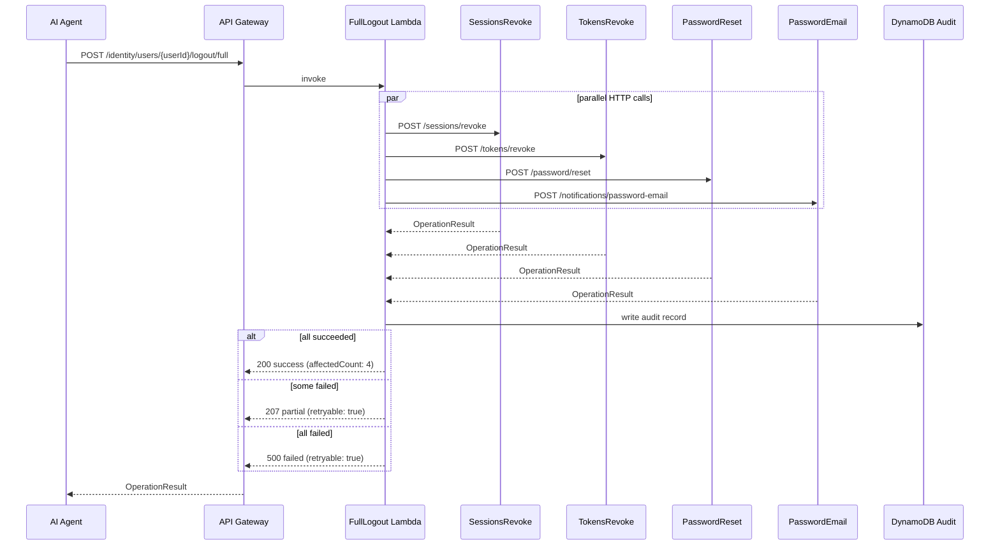
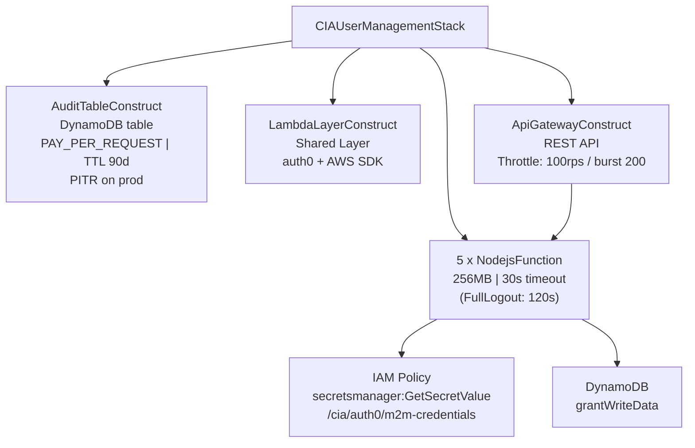

# CIA User Management Stack

AWS CDK stack for NCA's **CIA (Customer Identity & Access) Platform**. This is the first domain stack in the CIA Identity Platform agentic architecture. It wraps Auth0 Management API user lifecycle operations as atomic, agent-ready Lambda endpoints.

---

## Tech Stack

| Layer | Technology |
|---|---|
| Runtime | Node.js 18, TypeScript (strict) |
| IaC | AWS CDK v2 (v2.135.0) |
| Auth0 SDK | `auth0` npm package — `ManagementClient` |
| Testing | Jest + ts-jest |
| Linting | ESLint + Prettier |
| Region | `ap-southeast-2` |

---

## API Endpoints

All routes are scoped under `/identity/users/{userId}`:

| Method | Path | Lambda | Operation |
|---|---|---|---|
| POST | `/identity/users/{userId}/sessions/revoke` | `SessionsRevoke` | Revoke all active sessions |
| POST | `/identity/users/{userId}/tokens/revoke` | `TokensRevoke` | Revoke all refresh tokens |
| POST | `/identity/users/{userId}/password/reset` | `PasswordReset` | Trigger a password reset |
| POST | `/identity/users/{userId}/notifications/password-email` | `PasswordEmail` | Send password change notification email |
| POST | `/identity/users/{userId}/logout/full` | `FullLogout` | Orchestrate all 4 steps above atomically |

---

## OperationResult Response Contract

Every handler returns this interface — no exceptions:

```typescript
interface OperationResult {
  operation: string;       // snake_case e.g. "sessions_revoke"
  userId: string;
  status: "success" | "failed" | "partial";
  affectedCount?: number;
  retryable?: boolean;     // critical for agent retry decisions
  reason?: string;         // critical for agent next-step logic
  timestamp: string;       // ISO 8601
}
```

---

## High-Level Architecture

```mermaid
flowchart TD
    subgraph Client["Client / AI Agent"]
        AGENT[AI Agent or API Consumer]
    end

    subgraph AWS["AWS — ap-southeast-2"]
        subgraph APIGW["API Gateway\nCIAUserManagement-{stage}"]
            R1["POST /sessions/revoke"]
            R2["POST /tokens/revoke"]
            R3["POST /password/reset"]
            R4["POST /notifications/password-email"]
            R5["POST /logout/full"]
        end

        subgraph Lambdas["Lambda Functions (Node.js 18)"]
            L1["SessionsRevoke"]
            L2["TokensRevoke"]
            L3["PasswordReset"]
            L4["PasswordEmail"]
            L5["FullLogout\n(orchestrator)"]
        end

        subgraph SharedLayer["Lambda Layer (Shared)"]
            SL["auth0-client.ts\nresponse.ts\nerrors.ts"]
        end

        SM["AWS Secrets Manager\n/cia/auth0/m2m-credentials"]
        DDB["DynamoDB\nCIAUserManagement-Audit-{stage}\nPK: userId | SK: timestamp | TTL: 90d"]
    end

    subgraph Auth0["Auth0 Tenant\n{domain}.au.auth0.com"]
        A0["Management API\n(M2M Client)"]
    end

    AGENT -->|HTTP POST| APIGW

    R1 --> L1
    R2 --> L2
    R3 --> L3
    R4 --> L4
    R5 --> L5

    L5 -->|HTTP POST x4\nfetch() in parallel| R1
    L5 -->|HTTP POST x4\nfetch() in parallel| R2
    L5 -->|HTTP POST x4\nfetch() in parallel| R3
    L5 -->|HTTP POST x4\nfetch() in parallel| R4

    L1 & L2 & L3 & L4 -->|Reads credentials\n(cold start only)| SM
    SM -->|clientId\nclientSecret\ndomain| L1

    L1 & L2 & L3 & L4 -->|Calls Auth0 API| A0
    L1 & L2 & L3 & L4 & L5 -->|Write audit record| DDB

    SL -.->|imported by| L1 & L2 & L3 & L4 & L5
```

---

## Full Logout Orchestration Flow



---

## CDK Constructs



---

## File Structure

```
.
├── bin/
│   └── app.ts                          # CDK entry point
├── lib/
│   ├── cia-user-management-stack.ts    # Main CDK Stack
│   └── constructs/
│       ├── api-gateway.construct.ts    # API Gateway (REST API + routes)
│       ├── audit-table.construct.ts    # DynamoDB audit table
│       └── lambda-layer.construct.ts  # Shared Lambda layer
├── handlers/
│   ├── sessions/revoke.handler.ts
│   ├── tokens/revoke.handler.ts
│   ├── password/reset.handler.ts
│   ├── notifications/password-email.handler.ts
│   └── logout/full.handler.ts          # Orchestrator (HTTP fan-out)
├── shared/
│   ├── auth0-client.ts                 # Singleton ManagementClient (cached)
│   ├── response.ts                     # OperationResult builders
│   └── errors.ts                       # Error classes + retry detection
├── layer/
│   └── nodejs/package.json             # Lambda layer dependencies
└── test/
    ├── sessions.revoke.test.ts
    └── logout.full.test.ts
```

---

## Architecture Rules

1. Every Auth0 Management API operation = its own Lambda handler file
2. Every handler returns the `OperationResult` interface — no exceptions
3. The Auth0 `ManagementClient` is **never** instantiated in a handler — always imported from `shared/auth0-client.ts`
4. Secrets come from AWS Secrets Manager only — never env vars, never hardcoded
5. The `/logout/full` orchestrator calls the other 4 atomic endpoints via HTTP — it does **not** duplicate their Auth0 logic

---

## Deployment

```bash
# Install dependencies
npm install

# Build TypeScript
npm run build

# Deploy to a stage (dev | uat | prod)
cdk deploy -c stage=dev
cdk deploy -c stage=uat
cdk deploy -c stage=prod
```

### AWS Secrets Manager — required before first deploy

Create the secret at path `/cia/auth0/m2m-credentials` with shape:

```json
{
  "clientId": "<auth0-m2m-client-id>",
  "clientSecret": "<auth0-m2m-client-secret>",
  "domain": "<tenant>.au.auth0.com"
}
```

---

## Testing

```bash
npm test
npm run test:coverage
```

---

## Stage Behaviour Differences

| Feature | dev / uat | prod |
|---|---|---|
| DynamoDB removal policy | DESTROY | RETAIN |
| Point-in-time recovery | off | on |
| Lambda bundling | unminified | minified |
| Stack name | `CIAUserManagement-dev` | `CIAUserManagement-prod` |
