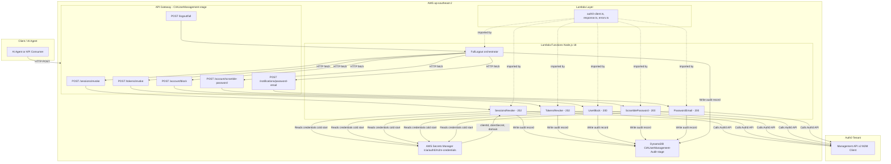
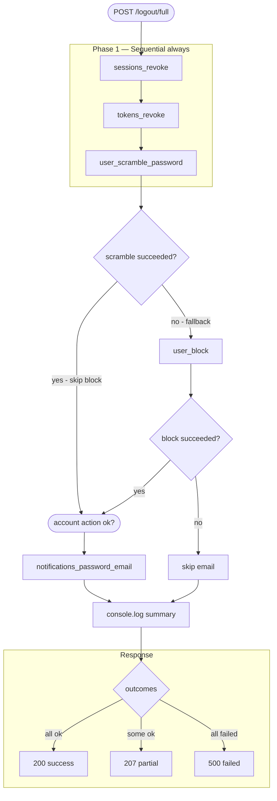
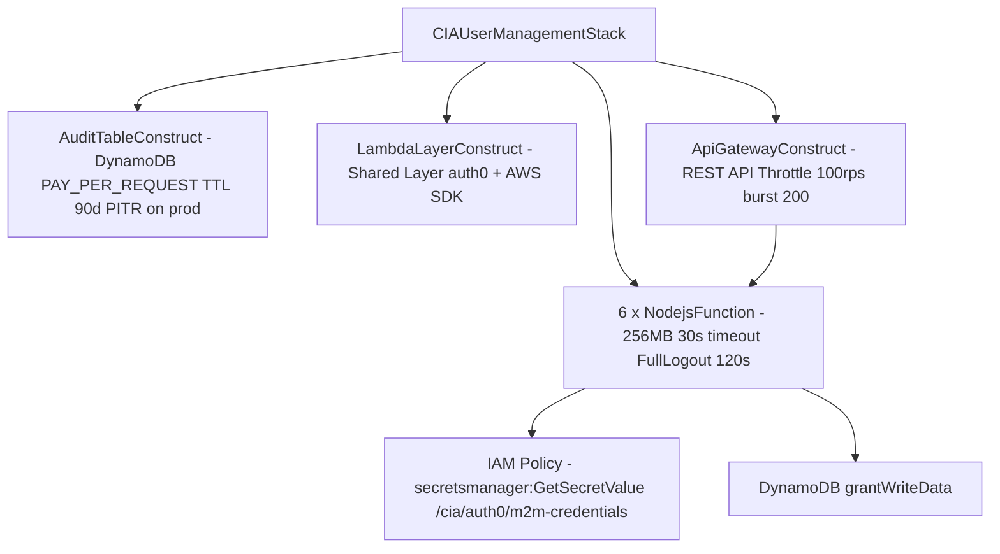

# CIA User Management Stack

AWS CDK stack for NCA's **CIA (Customer Identity & Access) Platform**. This is the first domain stack in the CIA Identity Platform agentic architecture. It wraps Auth0 Management API user lifecycle operations as atomic, agent-ready Lambda endpoints.

---

## Tech Stack

| Layer | Technology |
|---|---|
| Runtime | Node.js 18, TypeScript (strict) |
| IaC | AWS CDK v2 (v2.135.0) |
| Auth0 SDK | `auth0` npm package — `ManagementClient` |
| Testing | Jest + ts-jest |
| Linting | ESLint + Prettier |
| Region | `ap-southeast-2` |

---

## API Endpoints

All routes are scoped under `/identity/users/{userId}`:

| Method | Path | Lambda | Operation | Auth0 API |
|---|---|---|---|---|
| POST | `/identity/users/{userId}/sessions/revoke` | `SessionsRevoke` | Revoke all active sessions | `DELETE /v2/users/{id}/sessions` → `202` |
| POST | `/identity/users/{userId}/tokens/revoke` | `TokensRevoke` | Revoke all refresh tokens | `DELETE /v2/users/{id}/refresh-tokens` → `202` |
| POST | `/identity/users/{userId}/account/block` | `UserBlock` | Block user account | `PATCH /v2/users/{id}` `{blocked:true}` → `200` |
| POST | `/identity/users/{userId}/account/scramble-password` | `ScramblePassword` | Set random password, locking user out | `PATCH /v2/users/{id}` `{password, connection}` → `200` |
| POST | `/identity/users/{userId}/notifications/password-email` | `PasswordEmail` | Send password reset notification email | Auth0 Auth API |
| POST | `/identity/users/{userId}/logout/full` | `FullLogout` | Orchestrate all steps via conditional pipeline | — |

---

## OperationResult Response Contract

Every handler returns this interface — no exceptions:

```typescript
interface OperationResult {
  operation: string;       // snake_case e.g. "sessions_revoke"
  userId: string;
  status: "success" | "failed" | "partial";
  affectedCount?: number;
  retryable?: boolean;     // critical for agent retry decisions
  reason?: string;         // critical for agent next-step logic
  timestamp: string;       // ISO 8601
}
```

> **Note on `202` handlers:** `sessions/revoke` and `tokens/revoke` return `202 Accepted` — Auth0 processes these deletions asynchronously. No `affectedCount` is returned since Auth0 responds with an empty body.

---

## High-Level Architecture



---

## Full Logout Orchestration Pipeline

The `logout/full` handler runs a **conditional step pipeline** — not a simple parallel fan-out.



### Step execution by scenario

| Scenario | Steps invoked | fetch calls | Response |
|---|---|---|---|
| All succeed | sessions, tokens, scramble, email | 4 | `200` affectedCount: 4 |
| Scramble fails, block ok, email ok | sessions, tokens, scramble, block, email | 5 | `207` affectedCount: 4 |
| Scramble fails, block fails | sessions, tokens, scramble, block | 4 | `207` or `500` |
| Everything fails | sessions, tokens, scramble, block | 4 | `500` |

### Console log summary (emitted on every invocation)

```
[logout/full] userId=auth0|xyz | 4/4 steps succeeded
  ✓ sessions_revoke: success
  ✓ tokens_revoke: success
  ✓ user_scramble_password: success
  ✓ notifications_password_email: success
```

---

## CDK Constructs



---

## Environment Variables

| Variable | Set by | Default | Description |
|---|---|---|---|
| `STAGE` | CDK stack | — | Deployment stage (`dev`, `uat`, `prod`) |
| `AUDIT_TABLE_NAME` | CDK stack | — | DynamoDB audit table name |
| `AUTH0_CONNECTION` | CDK stack | `NewsCorp-Australia` | Auth0 database connection for `scramble-password` |
| `API_BASE_URL` | CDK stack | — | API Gateway base URL (injected into `FullLogout` only) |

Override `AUTH0_CONNECTION` per stage via CDK context:
```bash
cdk deploy -c stage=dev -c auth0Connection=NewsCorp-Dev
```

---

## File Structure

```
.
├── bin/
│   └── app.ts                               # CDK entry point
├── lib/
│   ├── cia-user-management-stack.ts         # Main CDK Stack
│   └── constructs/
│       ├── api-gateway.construct.ts         # API Gateway (REST API + routes)
│       ├── audit-table.construct.ts         # DynamoDB audit table
│       └── lambda-layer.construct.ts        # Shared Lambda layer
├── handlers/
│   ├── sessions/revoke.handler.ts           # DELETE /v2/users/{id}/sessions → 202
│   ├── tokens/revoke.handler.ts             # DELETE /v2/users/{id}/refresh-tokens → 202
│   ├── user/
│   │   ├── block.handler.ts                 # PATCH /v2/users/{id} {blocked:true} → 200
│   │   └── scramble-password.handler.ts     # PATCH /v2/users/{id} {password, connection} → 200
│   ├── notifications/password-email.handler.ts
│   └── logout/full.handler.ts               # Conditional pipeline orchestrator
├── shared/
│   ├── auth0-client.ts                      # Singleton ManagementClient (cached)
│   ├── response.ts                          # OperationResult builders
│   └── errors.ts                            # Error classes + retry detection
├── layer/
│   └── nodejs/package.json                  # Lambda layer dependencies
└── test/
    ├── sessions.revoke.test.ts
    ├── tokens.revoke.test.ts
    ├── user.block.test.ts
    ├── user.scramble-password.test.ts
    └── logout.full.test.ts
```

---

## Architecture Rules

1. Every Auth0 Management API operation = its own Lambda handler file
2. Every handler returns the `OperationResult` interface — no exceptions
3. The Auth0 `ManagementClient` is **never** instantiated in a handler — always imported from `shared/auth0-client.ts`
4. Secrets come from AWS Secrets Manager only — never env vars, never hardcoded
5. The `/logout/full` orchestrator calls atomic endpoints via HTTP — it does **not** duplicate their Auth0 logic
6. `scramble-password` uses Node.js built-in `crypto.randomBytes` — the generated password is never stored or logged

---

## Deployment

```bash
# Install dependencies
npm install

# Build TypeScript
npm run build

# Deploy to a stage (dev | uat | prod)
cdk deploy -c stage=dev
cdk deploy -c stage=uat
cdk deploy -c stage=prod

# Override Auth0 connection per stage
cdk deploy -c stage=uat -c auth0Connection=NewsCorp-UAT
```

### AWS Secrets Manager — required before first deploy

Create the secret at path `/cia/auth0/m2m-credentials` with shape:

```json
{
  "clientId": "<auth0-m2m-client-id>",
  "clientSecret": "<auth0-m2m-client-secret>",
  "domain": "<tenant>.au.auth0.com"
}
```

---

## Testing

```bash
npm test
npm run test:coverage
```

---

## Stage Behaviour Differences

| Feature | dev / uat | prod |
|---|---|---|
| DynamoDB removal policy | DESTROY | RETAIN |
| Point-in-time recovery | off | on |
| Lambda bundling | unminified | minified |
| Stack name | `CIAUserManagement-dev` | `CIAUserManagement-prod` |
